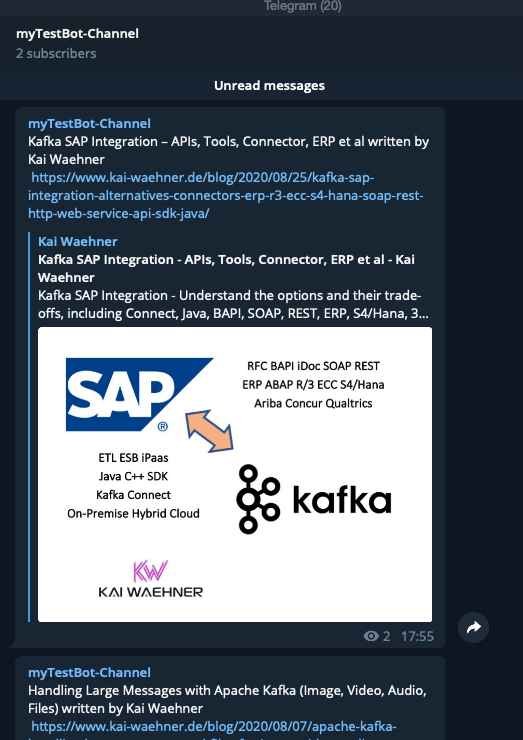

# 1. Webinar: Apache Kafka as a Service by Confluent Cloud Overview
Fully automatic demo will create kafka cluster in confluent cloud GCP  and start consumer and producer first. This will generate data and you will see monitoring informtation in Control Plane UI.


This demo expects some preparation work, before you can execute the scripts. If all the preparation is done, then everything starts automatically:
* Confluent Platform >5.4 is installed locally
* confluent cloud cli is installed locally (ccloud)
* iterm2 with "install shell integration enables (see iterm2->Install Shell integration)" is installed
* A Confluent Cloud Account have been created
* An environment in Confluent Cloud have to be created and named in the script `env-vars`
* Schema Registry has to be enabled for Confluent Cloud Environment

## Pre-Configure
the shell script `ccloud-vars` has some variables which need to fit to your Confluent Cloud environment
* Your Confluent Cloud Environment:  XX_CCLOUD_ENV=XXXXXX
* Your Confluent Cloud Login: XX_CCLOUD_EMAIL=YYYYYYY
* Your Confluent Cloud Password: XX_CCLOUD_PASSWORD=ZZZZZZZZZ
* The name for the Confluent Cluster: XX_CCLOUD_CLUSTERNAME=DEMODATAFLOW

## Start the confluent cloud cluster in GCP with consumer and producer
Start the demo
```bash
./00_create_ccloudcluster.sh
```
iterm Terminals with producer and consumer start automatically. You can login into your Confluent Cloud Account and check in GUI:
* Dataflow
* Topic
+ consumer monitoring
Note: It will take a while till everything working fine in GUI.

The cluster creation script will generate a `terraform/ccloud-vars` which need to be sourced later if you want to use terraform.

## Next step is to create a compute image in your cloud provider IaaS and run a self-managed cluster

To make our story more attractive I was planning to build a kind of new marketing channel. We will create a telegram bot and move all the cool stories around Apache Kafka into a new created telegram channel.
Our Kafka cluster is still running and is waiting to on-board a new use case.
The technical setup is like this (Kafka cluster in cluster, RSSFeed Connector in Compute instance andPython script pushing data to telegram bot)


You can create the cloud compute manually, or use your workstation/laptop.
I prepared a terraform, which create an aws compute instance with
* Confluent yum rep for Confluent Platform 5.5 activated
* Confluent connect installed
* tools installed like python, java
* alls the properties files setup for confluent cloud cluster, which we created before
* and the Python script  

start the provisioning via terraform
```bash
cd terraform
source env-tvars
source ccloud-tvars
terraform init
terraform plan
terraform apply
```
Terraform will create a complete setup in AWS and do not start the connector.

I Prefer to check manually if everything is working.
```bash
# login via ssh
ssh -i ~/keys/hackathon-temp-key.pem ec2-user@public-ip

# do some checks is pythons3 installaed
python3 --version
java -version

# is RSS Feed connector installed
ll /usr/share/java/confluent-hub-components

# try to start the standalone connector
# connect standalone check the output, if no errors do CTRL+C and start as daemon
sudo KAFKA_HEAP_OPTS="-Xms128m -Xmx256M" connect-standalone  ./my_standalone-connect.properties ./rssfeed.properties
# Start standalone as daemon
sudo KAFKA_HEAP_OPTS="-Xms128m -Xmx256M" connect-standalone -daemon ./my_standalone-connect.properties ./rssfeed.properties
```

Now, the topic `rssfeeds`should have a couple of events. The standalone connector is a RSS Feed Connector. This connector is configured to get the feeds from following blogs
* [Kai Waehner Blog](https://www.kai-waehner.de/feed/)
* [Confluent Blog ](https://rss.app/feeds/djRu8z7eUSewRfWC.xml)
You can check the topic viewer in your Confluent Cloud Control Plane UI and check if data is flying in

You will see that data is of format AVRO and schema is registered.

Now, create a telegram Bot and link it to a channel. The setup is very easy:
* Install the telegram app
* goto https://telegram.me/botfather
* enter in app within botfather
   * /newbot (close with enter)
   * give it name: my_rssfeedtestbot (close with enter)
   * give a username: my_rssfeedtestbot (close with enter)
   * write down the link t.me/my_rssfeedtestbot
   * save the token e.g. AAA:BBBBBBB
   * try this curl https://api.telegram.org/bot<your token>
   * next steps are optional:
      * Add description: /setdescription
        * This Channel will inform you about interesting stories around Apache Kafka, Confluent, event streaming platforms, architecture pattern and real use cases.
      * /setabouttext
        * Stories around Apache Kafka and Confluent.
      * /setuserpic  
        * choose image
* create a new channel
  * in app upper lef menu - choose new channel
  * Give a new name, a picture and a description
  * set it public or private and give a link e.g. https://t.me/mytestChannelRSSFEED
  * and save
  * add the my_rssfeedtestbot Bot as admin member
Now telegram is ready to receive your messages


The connector is running. Now our Python Service need to push the data from topic (AVRO Format) into the Telegram channel.
Please login into AWS and change the python script to push data to the right channel:
```bash
# login via ssh
ssh -i ~/keys/hackathon-temp-key.pem ec2-user@public-ip

# open the python script and change the correct data
nano consumer_rssfeeds.py
BOT_TOKEN = "AAA:BBBBBBB"
CHANNEL_ID = "@mytestChannelRSSFEED"


# save with CTRL+x and then enter

# now start the python service 
python3 consumer_rssfeeds.py -f ccloud.config -t rssfeeds
```
You should see in your telegram app all the new posts:


```bash
# If you want to start pythin into the background, do it like this
nohup python3 consumer_rssfeeds.py -f ccloud.config -t rssfeeds &
# you kill later like this
ps ax | grep consumer_rssfeeds.py
kill PID
```
Everything is working perfectly. We did create a new marketing channel in Telegram and pushing data from websites to kafka to telegram.


## Stop the demo showcase
drop the compute service with self-managed connector.
```bash
cd terrafrom
terraform destroy
```
To delete the complete Confluent Cloud environment:
```bash
cd ..
./02_drop_ccloudcluster.sh
```


