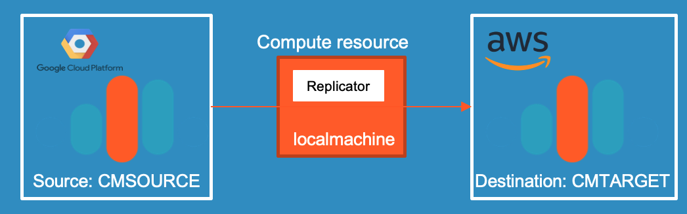

# Webinar 2: Using Connector with Apache Kafka as a Service, self-managed and fully-managed

We do have prepared a couple of connectors in this webinar.
* 2 datagen-connectors fully-managed (users, pageviews)
* RSSFeed Connector self-managed in aws compute instance (from [webinar 1](../webinar1/Readme.md))
* Replicator running on local machine (your laptop)

Fully automated demo showing replicating data from GCP Confluent Cloud to AWS Confluent Cloud.


This demo expects some preparation work, before you can execute the scripts. If all the preparation is done, then everything starts automatically:
* webinar 1 environment is up and running
* Confluent Platform >5.4 is installed locally
* confluent cloud cli is installed locally
* iterm2 with "install shell integration enables (see iterm2->Install Shell integration)" is installed
* A Confluent Cloud Account have to be created
* An environment in Confluent Cloud have to be created and named in the script
* Schema Registry has to be enabled for Confluent Cloud Environment

## Pre-Configure
the shell script `ccloud-vars` has some variables which need to fit to your Confluent Cloud environment
* Your Confluent Cloud Environment:  XX_CCLOUD_ENV=XXXXXX
* Your Confluent Cloud Login: XX_CCLOUD_EMAIL=YYYYYYY
* Your Confluent Cloud Password: XX_CCLOUD_PASSWORD=ZZZZZZZZZ
* The name for the Target Confluent Cluster: XX_CCLOUD_CLUSTERNAME2=TARGETAWS

## Start webinar 1 setup
If the environment of webinar is not running, please start it:
```bash
cd ../webinar1
source ccloud-vars
./00_create_ccloudcluster.sh
# now, create the self-managed RSSFEED connector in AWS
cd terraform
source env-tvars
source ccloud-tvars
terraform apply
```
Check if webinar1 environment is working and start connector
```bash
ssh -i ~/keys/hackathon-temp-key.pem ec2-user@public-ip-address
sudo KAFKA_HEAP_OPTS="-Xms128m -Xmx256M" connect-standalone -daemon ./my_standalone-connect.properties ./rssfeed.properties
sudo tail -f /var/log/kafka/connectStandalone.out
```
Now, Webinar1 setup is up and running and we can continue with webinar2

## Start the Replicator setup - additional cluster and replicator
Start the setup
```bash
cd ../../webinar2
source ccloud-vars
./00_create_ccloudcluster.sh
```
iterm Terminals with replictor, producer and consumer start automatically. 
* Now you enter data into the producer
* you will see that reading from source and target is with less difference, almost real-time. 
* You can login into your Confluent Cloud Account and check in GUI:
  * Dataflow
  * Topic
Note: It will take a while till everything working fine in GUI.

## Stop the demo showcase
To delete the complete environment:
```bash
cd webinar2
./02_drop_ccloudcluster.sh

# and stop environment of webinar1
cd ../webinar1/terraform
terraform destroy
cd .. 
./02_drop_ccloudcluster.sh
```


