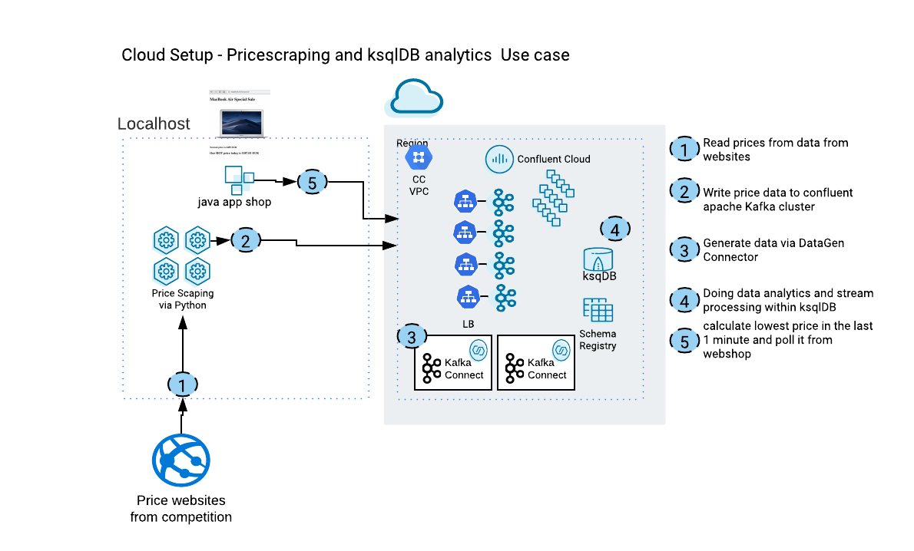

# Webinar 3: Doing ksqlDB analytics and price scraping

We do have prepared 
* Apache as a Service cluster in GCP by Confluent 
* 2 datagen-connectors fully-managed (users, pageviews)
* Python producer for scaping prices in the internet (on localhost)
* Java APP to read the best price via ksqlDB REST (on localhost)


Fully automated demo showing price scraping and ksqlDB analytics in Apache as a Service cluster in GCP by Confluent.


This demo expects some preparation work, before you can execute the scripts. If all the preparation is done, then everything starts automatically:
* A Confluent Cloud Account have to be created
* An environment in Confluent Cloud have to be created and named in the script
* Schema Registry has to be enabled for Confluent Cloud Environment
* webinar 1 environment is up and running
* Confluent Platform >5.4 is installed locally
* confluent cloud cli is installed locally
* iterm2 with "install shell integration enables (see iterm2->Install Shell integration)" is installed
* install the python packages: `pip3 install BeautifulSoup4 requests confluent_kafka datetime  uuid`

## Pre-Configure
the shell script `../webinar1/ccloud-vars` has some variables which need to fit to your Confluent Cloud environment
* Your Confluent Cloud Environment:  XX_CCLOUD_ENV=XXXXXX
* Your Confluent Cloud Login: XX_CCLOUD_EMAIL=YYYYYYY
* Your Confluent Cloud Password: XX_CCLOUD_PASSWORD=ZZZZZZZZZ
* The name for the Confluent Cluster: XX_CCLOUD_CLUSTERNAME=CMDATAFLOW

## Start webinar 1 setup
If the environment of webinar is not running, please start it:
```bash
cd ../webinar1
source ccloud-vars
./00_create_ccloudcluster.sh
# this time we do need terraform
```
Check if webinar1 environment is working via [Confluent Cloud UI](https://confluent.cloud/login)
Now, Webinar1 setup is up and running and we can continue with webinar3

## Start Connectors and ksqlDB fully-managed
Start the setup
```bash
cd ../../webinar3
./00_create_ccloudcluster.sh
```
iterm Terminals with python price scraper will start automatically. 
* price events will be produced into topic competitionprices
* events for users and pageviews will be generated into users and pageviews topics
* You can login into your Confluent Cloud Account and check in GUI:
  * Dataflow
  * Topic
Note: It will take a while till everything working fine in GUI.

Now do the analytics
```bash
# users and pageviews
ksql> CREATE STREAM pageviews WITH (kafka_topic='pageviews', value_format='AVRO');
ksql> CREATE TABLE users (id STRING PRIMARY KEY) WITH (kafka_topic='users', value_format='AVRO');
ksql> CREATE STREAM pageviews_female AS SELECT users.id AS userid, pageid, regionid, gender FROM pageviews LEFT JOIN users ON pageviews.userid = users.id WHERE gender = 'FEMALE';
ksql> CREATE STREAM pageviews_female_like_89 AS SELECT * FROM pageviews_female WHERE regionid LIKE '%_8' OR regionid LIKE '%_9';
ksql> CREATE TABLE pageviews_regions AS SELECT gender, regionid , COUNT(*) AS numusers FROM pageviews_female WINDOW TUMBLING (size 30 second) GROUP BY gender, regionid HAVING COUNT(*) > 1;
ksql> CREATE STREAM accomplished_female_readers WITH (value_format='JSON_SR') AS SELECT * FROM PAGEVIEWS_FEMALE WHERE CAST(SPLIT(PAGEID,'_')[2] as INT) >= 50;
ksql> select avg(numusers) from PAGEVIEWS_REGIONS GROUP BY NUMUSERS EMIT CHANGES;
# prices
ksql> CREATE STREAM competitionprices (rowkey STRING KEY, shop VARCHAR, title VARCHAR, pricestr VARCHAR, pricefloat DOUBLE) WITH (KAFKA_TOPIC='competitionprices',   VALUE_FORMAT='JSON');
ksql> CREATE TABLE competitionprices_table AS SELECT title as productname, shop, min(pricefloat) AS lowestprice_1minutes FROM competitionprices WINDOW TUMBLING (SIZE 1 MINUTES) GROUP BY title,shop EMIT CHANGES;
kqsl> SELECT lowestprice_1minutes-(lowestprice_1minutes/100) as ourPrice from competitionprices_table emit changes limit 1;
```

## Stop the demo showcase
To delete the complete environment:
```bash
cd webinar3
./02_drop_ccloudcluster.sh

# and stop environment of webinar1
cd ../webinar1
./02_drop_ccloudcluster.sh
```


