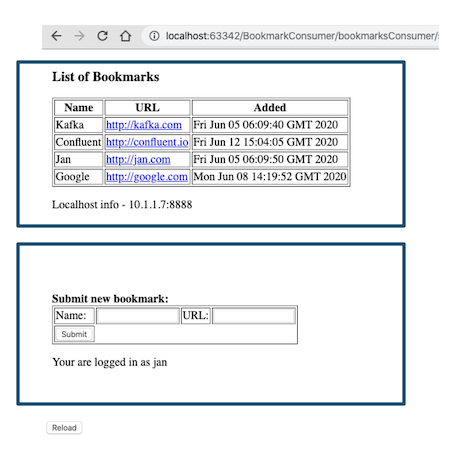
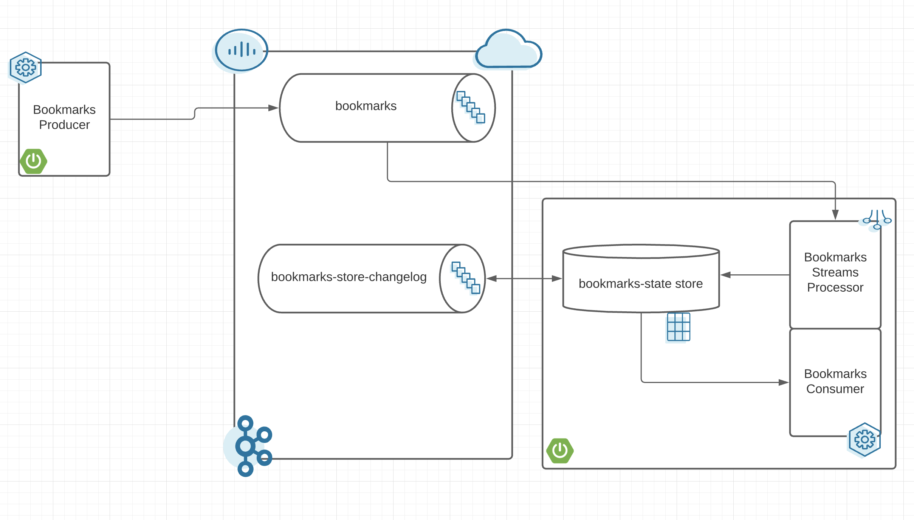

# Webinar 5: Building Microservices with Apache Kafka as Service in Cloud

Demo application to demonstrate building microservices using Springboot and Apache Kafka. Application is a simple Bookmarks manager. It allows you to:
* Create a new bookmark
* Update a bookmark 
* Delete a bookmark
* All bookmarks are stored with some username
* Read list of bookmarks for some user



Requirements to run it locally:
* Java 8 or Java 11
* Maven
* Connectivity to Confluent Cloud

This demo consist of two microservices build using Java Springboot:
* Producer - is used to send messages to Kafka
* Consumer - is used to retrieving messages from Kafka and storing them in local  state store. 

Demo Application architecture


## Compile
Compile microservices first:
```bash
mvn clean package
```
Check if compiled

## Configure
Configure connection to Confluent Cloud
```bash
edit application.properties
```
Check if saved

## Start the Producer
Start the Producer microservices
```bash
cd ../../webinar5
```

## Start the Consumer
Start the Consumer microservices
```bash
cd ../../webinar5
```

## Stop the demo showcase
To delete the complete environment:
```bash
cd webinar5
```


